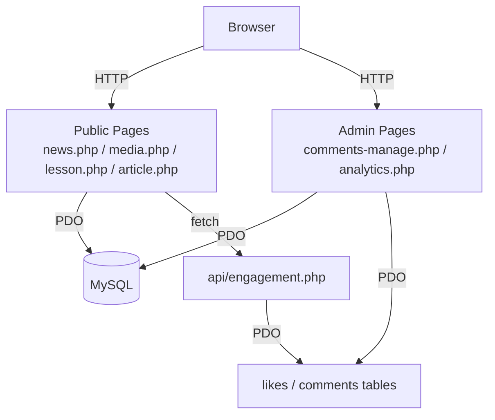

# Design Document — Missing Pages and Features

## Overview

This document describes the technical design for closing six identified gaps in the Runyakitara Hub PHP/MySQL language learning platform:

1. `news.php` — public article listing page (linked from nav/footer but absent)
2. `media.php` — public media library page (linked from nav/footer but absent)
3. Vocabulary section on `lesson.php` (column exists in DB, never rendered)
4. `excerpt` and `published_date` surfaced on `article.php` and in `admin/articles-manage.php`
5. `admin/comments-manage.php` — admin comments moderation page (absent)
6. Real engagement data (likes/comments) added to `admin/analytics.php`

All work is additive — no existing pages are removed or structurally changed beyond the targeted additions.

---

## Architecture

The platform follows a simple PHP-rendered MVC-lite pattern:

- **Data layer**: MySQL via PDO, accessed through `config/database.php` (`getDBConnection()` / `closeDBConnection()`)
- **Public pages**: Root-level `.php` files that query the DB, then render HTML with included nav/footer partials
- **Admin pages**: `admin/*.php` files behind a `$_SESSION['user_id']` gate, using shared sidebar/header partials
- **APIs**: `api/*.php` endpoints returning JSON, consumed by `js/engagement.js` and `js/realtime.js`
- **Soft delete**: `admin/includes/soft-delete.php` provides `softDelete()`, `restoreRecord()`, `hardDelete()`, and `ensureSoftDelete()`
- **Engagement**: `api/engagement.php` handles likes/comments; `js/engagement.js` renders the widget; `css/engagement.css` styles it
- **Real-time**: `js/realtime.js` polls content APIs every 15 s and prepends new cards

The six features fit cleanly into this architecture without introducing new patterns.



---

## Components and Interfaces

### 1. `news.php` — Public Article Listing

**Inputs**: none (GET params ignored)  
**DB query**: `SELECT * FROM articles WHERE deleted_at IS NULL ORDER BY created_at DESC`  
**Output**: HTML page using `.articles-section`, `.articles-grid`, `.article-card`, `.article-card-body`, `.article-card-footer` from `css/pages.css`

Date display logic (shared with `article.php`):
```php
$date = !empty($article['published_date']) ? $article['published_date'] : $article['created_at'];
echo date('F d, Y', strtotime($date));
```

Engagement and real-time: the `.articles-grid` container gets `data-realtime="articles"` so `js/realtime.js` can prepend new cards. Individual cards get `data-engagement data-eng-type="article" data-eng-id="{id}"` for the engagement widget.

> Note: `realtime.js` currently has no `articles` renderer. A minimal renderer will be added to the `renderers` map in `js/realtime.js`.

### 2. `media.php` — Public Media Library

**Inputs**: none  
**DB query**: `SELECT * FROM media WHERE deleted_at IS NULL ORDER BY created_at DESC`  
**Output**: HTML page using `.media-section`, `.media-grid`, `.media-card`, `.media-type-badge`, `.type-audio`, `.type-video` from `css/pages.css`

Media element selection:
```php
switch ($media['type']) {
    case 'audio': // <audio controls><source src="..."></audio>
    case 'video': // <video controls><source src="..."></video>
    case 'image': // 
}
```

Client-side filter bar (All / Audio / Video / Image) uses `data-type` attributes on cards and a small inline script — no server round-trip needed.

### 3. Vocabulary Section — `lesson.php`

**Change**: After the `<div class="lesson-text">` block, add a conditional block:
```php
<?php if (!empty($lesson['vocabulary'])): ?>
    <div class="lesson-vocabulary">
        <h4><i class="bi bi-book-half"></i> Vocabulary</h4>
        <div class="lesson-vocabulary-content">
            <?php echo nl2br(htmlspecialchars($lesson['vocabulary'])); ?>
        </div>
    </div>
<?php endif; ?>
```

**CSS**: New `.lesson-vocabulary` rule added to `css/lesson.css` — same card background and border-radius as `.lesson-content-card`, with a purple (`#8b5cf6`) left border accent.

No additional DB query — `SELECT *` already fetches `vocabulary`.

### 4. `excerpt` and `published_date` — `article.php` and `admin/articles-manage.php`

**`article.php`** (already renders `$article['excerpt']` conditionally — confirmed in source):
- Replace the date in `.article-meta` with the conditional date logic (same as news.php).
- No new DB query needed; `SELECT *` already fetches both columns.

**`admin/articles-manage.php`**:
- Add `excerpt` (textarea) and `published_date` (date input) fields to the Add/Edit modal.
- Update INSERT: `INSERT INTO articles (title, content, author, category, excerpt, published_date, created_at) VALUES (?,?,?,?,?,?,NOW())`
- Update UPDATE: `UPDATE articles SET title=?, content=?, author=?, category=?, excerpt=?, published_date=? WHERE id=?`
- Pass `article.excerpt` and `article.published_date` into `openEditModal()` JS function.

### 5. `admin/comments-manage.php` — Comments Moderation

**Session gate**: redirect to `login.php` when `$_SESSION['user_id']` is absent.

**POST actions** (all by comment `id`):
| action | SQL |
|--------|-----|
| `approve` | `UPDATE comments SET status='approved' WHERE id=?` |
| `reject`  | `UPDATE comments SET status='rejected' WHERE id=?` |
| `delete`  | `DELETE FROM comments WHERE id=?` (hard delete via `hardDelete()`) |

**GET query**: `SELECT * FROM comments ORDER BY created_at DESC`

**Pending badge count**:
```sql
SELECT COUNT(*) FROM comments WHERE status != 'approved'
```

**Table columns**: #, Content Type, Content ID, Name, Comment (truncated to 80 chars), Status badge, Date, Actions

**Filter tabs**: All / Pending / Approved / Rejected — client-side JS filtering on `data-status` row attributes.

**Sidebar**: Add a "Comments" link to the Communication section of `admin/includes/sidebar.php` with the pending badge count.

**CSS/layout**: Uses existing `css/dashboard.css`, `css/table-utils.css`, `css/modals.css`, shared sidebar and header partials.

### 6. Engagement Metrics — `admin/analytics.php`

New PHP queries added to the existing PHP block:
```php
// Engagement totals
$totalLikes    = $db->query("SELECT COUNT(*) FROM likes")->fetchColumn();
$totalComments = $db->query("SELECT COUNT(*) FROM comments")->fetchColumn();

// Comments by status
$commentsByStatus = ['approved'=>0,'pending'=>0,'rejected'=>0];
$rows = $db->query("SELECT status, COUNT(*) as c FROM comments GROUP BY status")->fetchAll(PDO::FETCH_ASSOC);
foreach ($rows as $r) { if (isset($commentsByStatus[$r['status']])) $commentsByStatus[$r['status']] = $r['c']; }

// Engagement per content type
$engByType = [];
$rows = $db->query("
    SELECT content_type, SUM(likes) as likes, SUM(comments) as comments FROM (
        SELECT content_type, COUNT(*) as likes, 0 as comments FROM likes GROUP BY content_type
        UNION ALL
        SELECT content_type, 0 as likes, COUNT(*) as comments FROM comments GROUP BY content_type
    ) t GROUP BY content_type
")->fetchAll(PDO::FETCH_ASSOC);
foreach ($rows as $r) { $engByType[$r['content_type']] = $r; }
```

New metric cards added to `.analytics-grid`: "Total Likes" (heart icon, `#f43f5e`) and "Total Comments" (chat icon, `#667eea`).

New chart section added below existing charts:
- Doughnut chart: "Comments by Status" (approved / pending / rejected)
- Bar chart: "Engagement by Content Type" (likes + comments per type: lesson, article, proverb, grammar, translation)

Zero-row handling: display `0` for counts; replace canvas with empty-state `<div>` when both totals are zero.

---

## Data Models

All tables already exist in `config/setup.sql`. No schema migrations are required.

### Relevant columns referenced by new features

**`articles`**
| column | type | notes |
|--------|------|-------|
| `excerpt` | TEXT | nullable; rendered as lead paragraph |
| `published_date` | DATE | nullable; preferred over `created_at` for display |
| `deleted_at` | DATETIME | soft-delete; NULL = active |

**`lessons`**
| column | type | notes |
|--------|------|-------|
| `vocabulary` | TEXT | nullable; rendered as vocabulary section when non-empty |

**`media`**
| column | type | notes |
|--------|------|-------|
| `type` | VARCHAR(20) | `'audio'`, `'video'`, or `'image'` |
| `file_path` | VARCHAR(500) | used as `src` for media elements |
| `deleted_at` | DATETIME | soft-delete |

**`likes`**
| column | type | notes |
|--------|------|-------|
| `content_type` | VARCHAR(30) | `lesson`, `article`, `proverb`, `grammar`, `translation` |
| `content_id` | INT | FK to content row |
| `ip_address` | VARCHAR(45) | one like per IP per content item |

**`comments`**
| column | type | notes |
|--------|------|-------|
| `content_type` | VARCHAR(30) | same set as likes |
| `content_id` | INT | FK to content row |
| `status` | VARCHAR(20) | `'approved'` (default), `'pending'`, `'rejected'` |

---

## Correctness Properties

*A property is a characteristic or behavior that should hold true across all valid executions of a system — essentially, a formal statement about what the system should do. Properties serve as the bridge between human-readable specifications and machine-verifiable correctness guarantees.*

### Property 1: Soft-delete filter excludes deleted records

*For any* articles (or media) table state containing a mix of soft-deleted and non-deleted rows, the listing query result must contain only rows where `deleted_at IS NULL`.

**Validates: Requirements 1.1, 2.1**

---

### Property 2: Article card rendering contains required fields

*For any* non-empty array of article rows, the rendered HTML for each card must contain the article's title, author, category, and a date string derived from `published_date` (when non-NULL) or `created_at` (when `published_date` IS NULL).

**Validates: Requirements 1.2, 1.3**

---

### Property 3: Article card link targets correct detail page

*For any* article row with a given `id`, the rendered card's anchor `href` must equal `article.php?id={id}`.

**Validates: Requirements 1.4**

---

### Property 4: Media element type matches record type

*For any* media record, the rendered HTML element must match the record's `type` field: `<audio>` for `'audio'`, `<video>` for `'video'`, `` for `'image'`, and the element's `src` (or `<source src>`) must equal `file_path`.

**Validates: Requirements 2.3, 2.4, 2.5**

---

### Property 5: Vocabulary section present iff vocabulary is non-empty

*For any* lesson record, the rendered lesson page must contain a vocabulary section if and only if the `vocabulary` column is non-empty (non-NULL and not all-whitespace).

**Validates: Requirements 3.1, 3.2**

---

### Property 6: Article date display prefers published_date

*For any* article record, the date displayed in the article metadata must equal `published_date` formatted as `F d, Y` when `published_date` is non-NULL, and `created_at` formatted as `F d, Y` when `published_date` is NULL.

**Validates: Requirements 1.3, 4.3, 4.4**

---

### Property 7: Comment status update is correct and idempotent

*For any* comment row and any valid moderation action (`approve` or `reject`), after the action is applied the comment's `status` column must equal the target status. Applying the same action a second time must leave the status unchanged (idempotent).

**Validates: Requirements 5.3, 5.4, 5.9**

---

### Property 8: Comment delete removes the row

*For any* comment row, after a `delete` action is applied, querying the `comments` table by that row's `id` must return no result.

**Validates: Requirements 5.5**

---

### Property 9: Pending badge count matches non-approved comments

*For any* state of the `comments` table, the pending badge count displayed in the sidebar must equal the number of rows where `status != 'approved'`.

**Validates: Requirements 5.6**

---

### Property 10: Engagement totals match actual row counts

*For any* state of the `likes` and `comments` tables, the total likes count displayed on the analytics page must equal `SELECT COUNT(*) FROM likes`, and the total comments count must equal `SELECT COUNT(*) FROM comments`.

**Validates: Requirements 6.1, 6.2**

---

### Property 11: Comments-by-status breakdown is accurate

*For any* state of the `comments` table, the per-status counts displayed on the analytics page must equal the result of `SELECT status, COUNT(*) FROM comments GROUP BY status` for each status value.

**Validates: Requirements 6.3**

---

## Error Handling

| Scenario | Handling |
|----------|----------|
| `articles` / `media` table empty | Render `.empty-state` block; no PHP error |
| `lessons.vocabulary` is NULL or empty string | Skip vocabulary section; `!empty()` guards both cases |
| `articles.excerpt` is NULL or empty string | Skip lead paragraph; `!empty()` guard |
| `articles.published_date` is NULL | Fall back to `created_at` |
| `comments` table empty | Render empty-state row in admin table |
| `likes` / `comments` tables empty | Display `0`; wrap chart canvas in empty-state div |
| DB connection failure | Existing `getDBConnection()` throws; pages show PHP error (no change from current behaviour) |
| Unauthenticated admin access | `$_SESSION['user_id']` check → `header('Location: login.php'); exit;` |
| Invalid comment action POST | Ignore unknown `action` values; no DB mutation |
| XSS in user-supplied fields | All output through `htmlspecialchars()`; comment text already sanitised in `api/engagement.php` |

---

## Testing Strategy

### Unit Tests

Focus on specific examples and edge cases:

- `news.php` renders the `.empty-state` block when the articles array is empty
- `media.php` renders the `.empty-state` block when the media array is empty
- `lesson.php` omits the vocabulary section when `vocabulary` is `NULL`
- `lesson.php` omits the vocabulary section when `vocabulary` is `''` (empty string)
- `article.php` omits the lead paragraph when `excerpt` is `NULL`
- `admin/comments-manage.php` redirects to `login.php` when no session exists
- `admin/analytics.php` displays `0` for likes and comments when both tables are empty

### Property-Based Tests

Use a PHP property-based testing library (e.g., **eris** or **PhpQuickCheck**) with a minimum of **100 iterations per property**.

Each test must include a comment referencing the design property it validates:
```
// Feature: missing-pages-and-features, Property N: <property text>
```

**Property 1 — Soft-delete filter**
Generate a random set of article rows, some with `deleted_at` set and some NULL. Run the listing query. Assert every returned row has `deleted_at IS NULL` and rows are in descending `created_at` order.
```
// Feature: missing-pages-and-features, Property 1: Soft-delete filter excludes deleted records
```

**Property 2 — Article card rendering**
Generate random article arrays (non-empty). Call the card render function. Assert each card's HTML contains the title, author, category, and a date string.
```
// Feature: missing-pages-and-features, Property 2: Article card rendering contains required fields
```

**Property 3 — Article card link**
Generate random article IDs. Assert the rendered card's `href` equals `article.php?id={id}`.
```
// Feature: missing-pages-and-features, Property 3: Article card link targets correct detail page
```

**Property 4 — Media element type**
Generate random media records with `type` in `['audio','video','image']` and a random `file_path`. Assert the rendered HTML contains the correct element tag and the `file_path` as the source attribute.
```
// Feature: missing-pages-and-features, Property 4: Media element type matches record type
```

**Property 5 — Vocabulary section presence**
Generate random lesson records, half with non-empty `vocabulary`, half with NULL or empty. Assert the vocabulary section appears iff `vocabulary` is non-empty.
```
// Feature: missing-pages-and-features, Property 5: Vocabulary section present iff vocabulary is non-empty
```

**Property 6 — Article date display**
Generate random article records, half with `published_date` set, half with NULL. Assert the displayed date equals `published_date` when set, else `created_at`.
```
// Feature: missing-pages-and-features, Property 6: Article date display prefers published_date
```

**Property 7 — Comment status update idempotence**
Generate random comment rows and random actions (`approve`/`reject`). Apply the action twice. Assert the status after the second application equals the status after the first.
```
// Feature: missing-pages-and-features, Property 7: Comment status update is correct and idempotent
```

**Property 8 — Comment delete**
Generate random comment rows. Apply the delete action. Assert the row no longer exists in the table.
```
// Feature: missing-pages-and-features, Property 8: Comment delete removes the row
```

**Property 9 — Pending badge count**
Generate random comment rows with mixed statuses. Assert the badge count equals the count of rows where `status != 'approved'`.
```
// Feature: missing-pages-and-features, Property 9: Pending badge count matches non-approved comments
```

**Property 10 — Engagement totals**
Generate random likes and comments rows. Assert the displayed totals equal the actual row counts.
```
// Feature: missing-pages-and-features, Property 10: Engagement totals match actual row counts
```

**Property 11 — Comments-by-status breakdown**
Generate random comment rows with mixed statuses. Assert the per-status breakdown matches the grouped count query.
```
// Feature: missing-pages-and-features, Property 11: Comments-by-status breakdown is accurate
```
